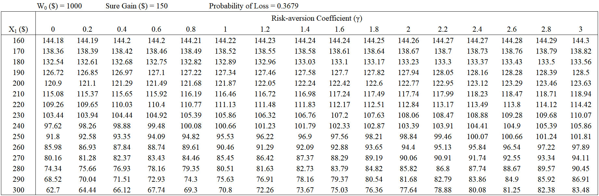

+++
title = '[Betting] CRRA Quiz'
date = '2025-01-02'
math = true
+++

Let's look at a way to assess someone's risk-aversion level. The plan involves developing a quiz (or experimental task) that asks participants to choose between several safe and risky options. By analyzing their choices, we can estimate their *risk-aversion coefficient*, \(\gamma\), using the constant relative risk aversion (CRRA) utility framework defined as:

$$
    u(W) = \begin{cases}
        \frac{W^{1-\gamma} - 1}{1 - \gamma} & \text{for } \gamma\geq0, \gamma\neq1\\
        \ln(W) & \text{for } \gamma = 1
    \end{cases}
$$

Where:
- \( W \): the final wealth.
- \( \gamma \): the relative risk aversion . A higher \(\gamma\) corresponds with greater risk-aversion, while \(\gamma = 1\) indicates risk-neutrality.
- \( \ln(W) \): logarithmic utility when \(\gamma = 1\), as \(\lim_{x\to1}\frac{x^{1-\gamma}-1}{1-\gamma}\) converges to \(\ln(x)\).

CRRA utility entails decreasing absolute risk aversion, the intuitive preference of taking on **less** risk as wealth increases.

Let's establish the quiz's decision framework. Participants begin with an initial wealth of $1,000. In each round of the quiz, participants are presented with two options:
- **Option A:** A sure gain of $150.
- **Option B:** A 36.79% probability of gaining \( $X_1 \) and a 63.21% probability of gaining \( $X_2 \).

The initial wealth amount is arbitrary and chosen to set a consistent baseline for all participants. The sure gain amount is also arbitrary and chosen to keep the subsequent demonstrative calculations consistent. The probability distribution (the \(\approx\) 63:37 split) is chosen as an approximation of the fixed inflection point at \(1/e\) in Prelec's probability weighting function, \( w(p)=\exp(-(-\ln p)^{\alpha}) \) (Prelec 1998). We will go into greater detail regarding the probability weighting function in the following section. For now, we are also avoiding the domain of losses and the concept of loss aversion altogether (although Option A can be interpreted as establishing a soft "reference point" of sorts at $1,150).

Now, we construct the \($X_2\) indifference points given different \($X_1\) and \(\gamma\) values. We can establish an indifference condition where a participant is equally likely to choose between the safe and the risky option. The indifferent condition can be represented as:
$$
u(\text{Option A}) = \mathbf{E}[u(\text{Option B})]
$$
Substituting our chosen options into the CRRA utility function, we have:
$$
u(1,000 + 150) = 0.3679 \cdot u(1,000 + X_1) + 0.6321 \cdot u(1,000 + X_2)
$$
If \(\gamma = 1\), we have logarithmic utility, where the indifference condition becomes:
\[
\ln(1150) = 0.3679 \cdot \ln(1,000 + X_1) + 0.6321 \cdot \ln(1,000 + X_2)
\]
Solving for \(X_2\):
\[
\ln(1,000 + X_2) = \frac{\ln(1150) - 0.3679 \cdot \ln(1,000 + X_1)}{0.6321}
\]
\[
1,000 + X_2 = \exp\left(\frac{\ln(1150) - 0.3679 \cdot \ln(1,000 + X_1)}{0.6321}\right)
\]
\[
X_2 = \exp\left(\frac{\ln(1150) - 0.3679 \cdot \ln(1,000 + X_1)}{0.6321}\right) - 1,000
\]
If \(\gamma \neq 1\), the indifference condition becomes:
\[
\frac{(1,000 + 150)^{1-\gamma} - 1}{1 - \gamma} = 0.3679 \cdot \frac{(1,000 + X1)^{1-\gamma} - 1}{1 - \gamma} + 0.6321 \cdot \frac{(1,000 + X2)^{1-\gamma} - 1}{1 - \gamma}
\]
Solving for \(X_2\):
\[
(1150)^{1-\gamma} = 0.3679 \cdot (1,000 + X_1)^{1-\gamma} + 0.6321 \cdot (1,000 + X_2)^{1-\gamma}
\]
\[
(1,000 + X_2)^{1-\gamma} = \frac{(1150)^{1-\gamma} - 0.3679 \cdot (1,000 + X_1)^{1-\gamma}}{0.6321}
\]
\[
X_2 = \left( \frac{(1150)^{1-\gamma} - 0.3679 \cdot (1,000 + X_1)^{1-\gamma}}{0.6321} \right)^{\frac{1}{1-\gamma}} - 1,000
\]
To save us time, I made a table with the appropriate \(X_2\) values for many combinations of \(X_1\) and \(\gamma\):

Now, we can administer the quiz using an adaptive questioning strategy that elicits an approximate \(\gamma\).

1. Start at some moderate \(\gamma\) value such as \(\gamma = 1\) (logarithmic utility), any \(X_1\) value, and their correspodning \(X_2\) value. An example is as follows:
    - **Option A:** Gain $150 (Total Wealth: $1,150)
    - **Option B:** 36.79% chance of gaining $200 (Total Wealth: $1,200) and 63.21% chance of gaining $121.87 (Total Wealth: $1,121.87)
2. 
    - **If Option A is chosen,** select a question from a higher \(\gamma\) column (e.g.,\(\gamma=1.2\)).
    - **If Option B is chosen,** select a question from a lower \(\gamma\) column (e.g., \(\gamma=0.8\)).
3. Continue presenting questions, moving up or down the \(\gamma\) scale based on the participant's initial choice. When the participant reverses their choice direction (e.g., switches from choosing risky to safe or vice versa), the quiz concludes and the \(\gamma\) value that aligns the closest with the last choice provides an estimate of the participant's risk aversion coefficient.

