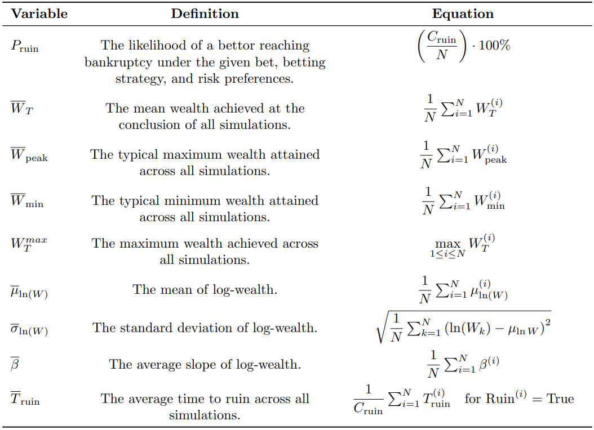

+++
title = '[BBM 4] The Simulation Process'
date = '2025-01-03'
math = true
+++

# Betting Behavior Methodologies 4: The Simulation Process

## A Single Simulation

**The main limitation** of our generalized formula with respect to modeling "irrational" betting behavior is that it still maximizes utility in a "rational" way, and thus, like the classical Kelly, will still **always** advise against placing a nonzero wager on a negative EV bet. However, one way we can effectively loosen this restriction in our simulations is through probability weighting or by introducing some distinction between "perceived" probabilities and actual probabilities. In accordance with our established decision framework, the simulation tests a single chosen bet against a bet sizing strategy each time we run it. Let us walk through the process for a **single** simulation. Before initiating the simulations, several critical parameters are established:

- **\( N \)**: The total number of independent betting sequences to be simulated to ensure statistical significance.

- **\( T \)**: The maximum number of bets allowed per simulation to prevent indefinite betting sequences.
- **\( L \)**: The wealth level at which the bettor is considered bankrupt, terminating the sequence.
- **\( W_0 \)**: Starting wealth of the bettor.
- **\( \gamma \)**: The investor's degree of risk aversion, influencing the optimal betting fraction.
- **\( p_{\text{perceived}} \)**: The weighted, subjective belief about the likelihood of the bet winning.
- **\( p_{\text{actual}} \)**: The true likelihood of the bet winning.
- **\( b \)**: The net odds of the bet offering, i.e., the potential profit per unit wagered.

Each simulation encapsulates a sequential series of bets where the proportion of the current wealth \( W \) that the bettor allocates to bet, \( f^* \), is based on \( p_{\text{perceived}} \) and aligns with their risk preferences as characterized by \( \gamma \):

$$
f^* = \frac{\left(\frac{p_{\text{perceived}}\cdot b}{1-p_{\text{perceived}}}\right)^\frac{1}{\gamma}-1}{b+\left(\frac{p_{\text{perceived}}\cdot b}{1-p_{\text{perceived}}}\right)^\frac{1}{\gamma}}
$$

For each betting round, the amount to wager is computed as a fraction of the current wealth:
\( A_t = W_t \cdot f^* \)
where \( W_t \) is the wealth before the \( t \)-th bet. The outcome of the bet is determined based on the **actual** probability of winning, \( p_{\text{actual}} \). A uniformly distributed random variable \( U \sim \mathcal{U}(0,1) \) can be generated to decide the outcome. If \( U < p_{\text{actual}} \), the bet is won; if else, the bet is lost. Depending on the outcome, the wealth is updated as follows:

$$
W_{t+1} = \begin{cases}
    W_t \cdot (1+f^*\cdot b) & \text{if win,}\\
    W_t \cdot(1-f^*) & \text{if lose.}
\end{cases}
$$

The updated wealth \( W_{t+1} \) can be appended to a wealth history, \( \mathcal{W} = \{W_0, W_1, W_2,..., W_{t+1}\} \), allowing us to track and analyze our simulation outcomes at a granular level. We can also check for peak and minimum wealth levels, where \( W_{peak} = \text{max}(W_{peak}, W_{t+1}) \) and \( W_{min} = \text{min}(W_{min}, W_{t+1}) \). At each step, the simulation should check for bankruptcy: if \( W_{t+1} \leq L \), the simulation is marked as bankrupt, and the betting loop terminates.

After \( T \) bets or upon bankruptcy, the following metrics can be recorded:

- **\( W_T \)**: The wealth level at termination.

- **\( W_{\text{peak}} \)**: The highest wealth achieved during the simulation.
- **\( W_{\text{min}} \)**: The lowest wealth reached during the simulation.
- **\( T_f \)**: Total number of bets before termination.
- **\( \text{Ruin}^{(i)} \)**: Whether the simulation ended in ruin.
- **\( \mu_{\ln(W)} \)**: The mean log-wealth, which can also be represented as:
    $$
    \mu_{\ln(W)} = \frac{1}{T_f}\sum_{k=1}^{T_f}\ln(W_k)
    $$
- **\( \sigma_{\ln(W)} \)**: The standard deviation of log-wealth, which can also be represented as:
    $$
    \sigma_{\ln(W)} = \sqrt{\frac{1}{T_f} \sum_{k=1}^{T_f} \left( \ln(W_k) - \mu_{\ln (W)} \right)^2}
    $$
- **\( \beta \)**: The slope of log-wealth, which can be determined by fitting a linear regression model to the log-transformed wealth history.
    $$
    \ln(W_k) = \beta k + \alpha + \epsilon_k \quad \Rightarrow \quad \beta = \frac{\ln(W_k) - \alpha - \epsilon_k}{k}
    $$
    where \( \alpha \) is the intercept and \( \epsilon_k \) represents residuals.

## Multiple Simulations

To obtain statistically significant results, the simulation should be executed \( N \) times, from \( i=1 \) to \( N \), each being independent betting sequences with the same parameters. We can establish a counter variable, \( C_{\text{ruin}} \), that increments by one each time a simulation results in bankruptcy to track the number of simulations that terminate before reaching \( T \) bets. Table 4 includes some aggregate statistics we can compute.

- **\( P_{\text{ruin}} \)**: The likelihood of a bettor reaching bankruptcy under the given bet, betting strategy, and risk preferences.
    \(
    \left(\dfrac{C_{\text{ruin}}}{N}\right) \cdot 100\%
    \)

- **\( \overline{W}_T \)**: The mean wealth achieved at the conclusion of all simulations.
    \(
    \dfrac{1}{N}\sum_{i=1}^{N} W_T^{(i)}
    \)

- **\( \overline{W}_{\text{peak}} \)**: The typical maximum wealth attained across all simulations.
    \(
    \dfrac{1}{N}\sum_{i=1}^{N} W_{\text{peak}}^{(i)}
    \)

- **\( \overline{W}_{\text{min}} \)**: The typical minimum wealth attained across all simulations.
    \(
    \dfrac{1}{N}\sum_{i=1}^{N} W_{\text{min}}^{(i)}
    \)

- **\( W_{T}^{max} \)**: The maximum wealth achieved across all simulations.
    \(
    \underset{1 \leq i \leq N}{\text{max}} \, W_T^{(i)}
    \)

- **\( \overline{\mu}_{\ln(W)} \)**: The mean of log-wealth.
    \(
    \dfrac{1}{N} \sum_{i=1}^{N} \mu_{\ln(W)}^{(i)}
    \)

- **\( \overline{\sigma}_{\ln(W)} \)**: The standard deviation of log-wealth.
    \(
    \sqrt{\dfrac{1}{N} \sum_{k=1}^{N} \left( \ln(W_k) - \mu_{\ln W} \right)^2}
    \)

- **\( \overline{\beta} \)**: The average slope of log-wealth.
    \(
    \dfrac{1}{N} \sum_{i=1}^{N} \beta^{(i)}
    \)

- **\( \overline{T}_{\text{ruin}} \)**: The average time to ruin across all simulations.
    \( \quad
    \dfrac{1}{C_{\text{ruin}}}\sum_{i=1}^{N} T_{\text{ruin}}^{(i)} \quad \text{for } \text{Ruin}^{(i)} = \text{True}
    \)

