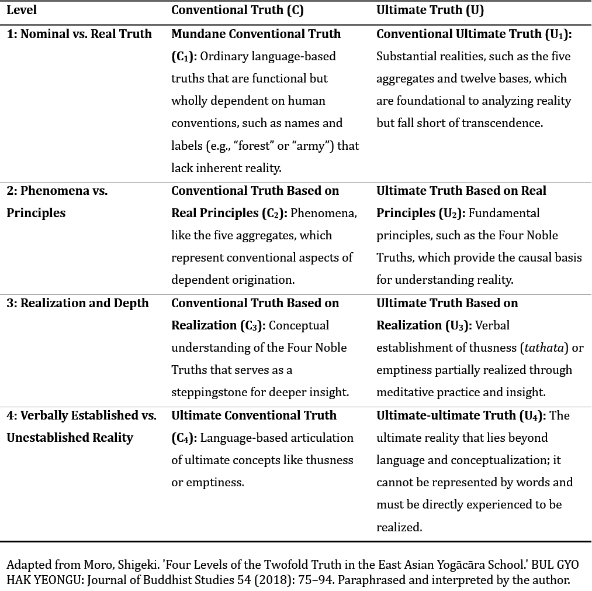

+++
title = 'Five Levels of Truth'
date = '2025-01-05'
math = true
+++
#### Level 3

Let's talk a bit more about the Five Truths Framework I structure this site on. As mentioned in the first post, the framework I'm using is based on Nagarjuna's Two Truths doctrine, a concept central to Mahayana Buddhism. Although similar ideas can be traced back to pre-Buddha times (Yajnavalkya 2008, III.2.3.6), the doctrine was largely established in Nāgārjuna’s *Mūlamadhyamakakārikā* (MMK) around 150 CE, which distinguished between two categories of truth:
1.	Conventional Truths (*Samvrti-satya*): Truths perceived and used in everyday life, shaped by conventions, mutual dependencies, and appearances. These truths rely on relational and contingent phenomena that obscure the ultimate nature of reality.
2.	Ultimate Truths (*Paramārtha-satya*): Truths revealing the true nature of reality as it is – free from conceptual overlays and obscurations. This corresponds to the realization of emptiness (*śūnyatā*) (Nāgārjuna 1986, 24.8).

Around 600 years after the composition of the MMK, Japanese Yogācāra scholar-monk Zenju deconstructed the Two Truths into four hierarchical levels, reflecting a progression from surface understandings to profound realizations. Zenju’s “Four Levels of the Twofold Truths” can be observed in the table below (Moro 2018, 79-90).

It's important to note that Nāgārjuna’s Two Truths are not meant to be separate realities, but rather two aspects of the same reality. Nāgārjuna’s doctrine of “the emptiness of emptiness” asserts that emptiness itself is dependently arisen, as it cannot exist inherently and relies on conventional phenomena to be understood (Jerome 2018). This interdependence implies that emptiness is also empty; if it were inherently existent, it would contradict the nature of emptiness and negate the truth that all phenomena are empty. Thus, emptiness can only conventionally exist, and for the unenlightened, ultimate truths are accessible only through conventional truths. The Two Truths are therefore ontologically inseparable – like two sides of the same coin. Zenju’s Four Levels conveys a similar idea but shifts the parity between conventional and ultimate levels down one step: the levels of conventional truths represent words, and their corresponding ultimate truths represent the substances that establish the words. As C1 is the “truth established only by language or verbal convention, while U4 is the truth based only on reality beyond language,” C2 is equivalent to U1, C3 is equivalent to U2, C4 is equivalent to U3, and C1 is too devoid of ontological basis to have an equivalent level of ultimate truth, while U4 transcends language and concepts in a way that is fundamentally incompatible with any level of conventional truth (Moro 2018, 82-83). Thus, I would argue that it is more helpful to understand the hierarchy through five levels, as shown in Table 2. I will be referring to the five levels – as opposed to the four levels – going forward.
